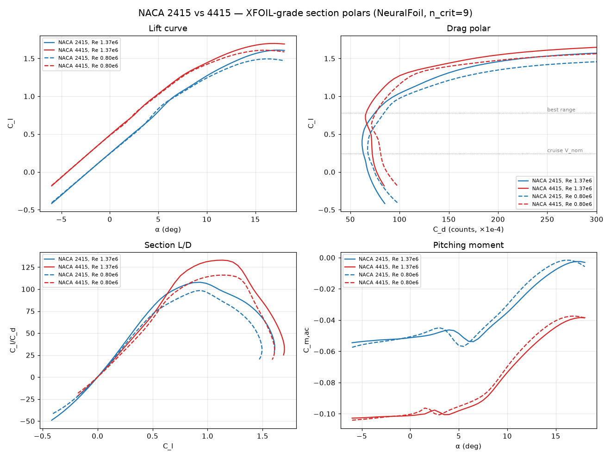

# Aerodynamic & Performance Analysis — Single-Engine Gasoline UAV

**Prepared:** 2026-06-14 · **Configuration:** high-aspect rectangular wing, twin-boom-style tubular fuselage, single tractor (puller) gasoline engine (DLE-120), 28×10 propeller.

> ⚠️ **Read this first.** This is a *first-order analytical estimate* built from the supplied data sheet using standard handbook methods (component drag build-up, lifting-line induced drag, ISA atmosphere, energy-based fuel model). It is intended for design-trade and sanity-check purposes — **not** a substitute for wind-tunnel data, CFD, or flight test. All assumptions are stated explicitly so any number can be re-derived or corrected. Where the supplied data sheet is internally inconsistent, this is flagged.

---

## 1. Input parameters (as supplied)

| Parameter | Value | Parameter | Value |
|---|---|---|---|
| Wingspan b | 4.0 m | MTOW | 50 kg |
| Wing area S | 2.0 m² (4.0 × 0.5 m, rectangular) | Empty weight | 19 kg |
| Root = tip chord | 0.50 m | Max payload | 20 kg |
| Airfoil | "NACA 25112" (see §2.3) | Fuel capacity | 15 L |
| Engine | DLE-120 (120 cm³ gasoline twin) | Cruise burn | 60 mL/min = 3.6 L/h |
| Propeller | 28×10 tractor | V_min | 81 km/h (22.5 m/s) |
| Static thrust | 26 kgf (≈255 N) | V_nom | 150 km/h (41.7 m/s) |
| Fuselage pod | Ø160 mm × 1.8 m | V_ne | 180 km/h (50.0 m/s) |
| Tail boom | Ø100 mm × 1.0 m | Load factor | +4.8 / −2.4 g |
| Max endurance | 10 h | Ferry range | 600 km |
| Service altitude | 500 m / 4000 m AMSL | Max altitude | 5000 m |

### 1.1 Derived geometry & loading

| Quantity | Value | Note |
|---|---|---|
| Aspect ratio AR = b²/S | **8.0** | moderate-high; good for efficiency |
| Mean chord | 0.50 m | constant (rectangular) |
| Wing loading W/S @ MTOW | **245 N/m² = 25.0 kg/m²** | high for this class → fast, but high stall speed |
| Power loading @ ~12 hp | **4.17 kg/hp** | well powered |
| Static thrust-to-weight | **0.52** | very strong for a fixed-wing |
| Fuel mass (gasoline ρ≈0.72) | 10.8 kg | 19 + 10.8 + 20 ≈ 49.8 kg ✔ closes to MTOW |

The mass budget closes almost exactly: **19 kg empty + ~10.8 kg fuel + 20 kg payload ≈ 50 kg MTOW.** The airframe is therefore designed *to* 50 kg, not arbitrarily limited there.

---

## 2. Method & assumptions

### 2.1 Atmosphere (ISA)

| Altitude | Temp | Density ρ | μ (Pa·s) | Speed of sound |
|---|---|---|---|---|
| 0 m (ref) | 15.0 °C | 1.2250 kg/m³ | 1.789e-5 | 340.3 m/s |
| **500 m** | 11.8 °C | **1.1673 kg/m³** | 1.774e-5 | 338.4 m/s |
| **4000 m** | −11.0 °C | **0.8191 kg/m³** | 1.661e-5 | 324.6 m/s |
| 5000 m | −17.5 °C | 0.7361 kg/m³ | 1.628e-5 | 320.5 m/s |

Density ratio σ(4000 m)/σ(SL) = 0.669 — this is the single biggest driver of the differences between the two altitude cases.

### 2.2 Drag model

Parasite drag from a **component build-up** (Hoerner / Raymer form factors, turbulent flat-plate skin friction `Cf = 0.455/(log₁₀Re)^2.58`). Induced drag from `C_Di = k·C_L²` with `k = 1/(π·e·AR) = 0.0497`, Oswald efficiency **e = 0.80** (rectangular wing, Raymer estimate 0.81, derated for fuselage interference & trim).

Drag polar: **C_D = 0.0293 + 0.0497·C_L²**

#### Parasite-drag build-up (at 500 m, 41.7 m/s — C_D0 referenced to S = 2 m²)

| Component | Re | C_f | Form factor | Q | S_wet (m²) | ΔC_D0 |
|---|---:|---:|---:|---:|---:|---:|
| Wing (exposed) | 1.37e6 | 0.00422 | 1.345 | 1.00 | 3.92 | 0.0111 |
| Fuselage pod Ø160×1800 | 4.94e6 | 0.00337 | 1.070 | 1.00 | 0.95 | 0.0017 |
| Tail boom Ø100×1000 | 2.74e6 | 0.00373 | 1.085 | 1.00 | 0.31 | 0.0006 |
| Horizontal tail (~0.30 m²) | 0.82e6 | 0.00464 | 1.280 | 1.05 | 0.62 | 0.0019 |
| Vertical tail (~0.20 m²) | 0.82e6 | 0.00464 | 1.280 | 1.05 | 0.41 | 0.0013 |
| Engine cooling + exposed cylinders | — | — | — | — | — | 0.0060 |
| Fixed landing gear | — | — | — | — | — | 0.0035 |
| Misc / excrescence / leakage (+12%) | — | — | — | — | — | 0.0031 |
| **Total C_D0** | | | | | | **0.0293** |

The exposed air-cooled engine, fixed gear and large prop dominate "non-wing" drag — typical for this hobby-gas-engine class. A cowled/cleaned installation could plausibly reach C_D0 ≈ 0.022 (see §8).

### 2.3 Lift model & the airfoil

- 3-D lift-curve slope: `CLα = a₀/(1+a₀/(π·e·AR)) = 4.787/rad = 0.0836/deg`.
- Zero-lift angle α₀ ≈ −2° (cambered section); **C_L = 0.0836·(α + 2°)**.
- Assumed **C_Lmax = 1.40** (clean, no flaps; consistent with a ~12 %-thick cambered section at the wing Reynolds numbers here, ~0.8–1.4×10⁶).

> **Airfoil note:** "NACA 25112" is not a standard NACA designation. Read as a 5-digit family it parses to design C_L ≈ 0.3, max camber far aft (~25 % chord) and **12 % thickness** — most likely a transcription of a NACA 5-digit section (e.g. 23012) or "2412". A 12 %-thick cambered section is assumed throughout. If the true section differs, C_Lmax, α₀ and C_D0(wing) shift, but the trends below hold.

### 2.4 Propulsion & fuel model

- Shaft power: DLE-120 ≈ **12 hp (8.8 kW)** at sea level; normally-aspirated lapse with density `P ∝ σ`.
- Propeller efficiency η_p ≈ 0.70 in cruise (static thrust 255 N reproduces the 26 kgf figure).
- **Fuel model:** fuel flow ∝ thrust power, calibrated to the manufacturer's quoted cruise point (3.6 L/h at V_nom). This yields an effective overall efficiency **η_overall ≈ 0.087** (fuel-energy → thrust-power), typical for a part-throttle 2-stroke gasoline engine. Gasoline energy density 31.25 MJ/L. Fuel flow then scales with required power at every speed.

---

## 3. Drag polar & key aerodynamic figures

| Figure | Value | At |
|---|---|---|
| Zero-lift drag C_D0 | 0.0293 | — |
| Induced factor k | 0.0497 | — |
| **(L/D)_max** | **13.1** | C_L = 0.77 |
| Speed for (L/D)max @ 500 m | 23.4 m/s (84 km/h) | best range |
| C_L for min power (max endurance) | 1.33 | near stall → use V_min |
| Stall speed @ 500 m (MTOW) | 62 km/h (17.3 m/s) | C_Lmax=1.4 |
| Stall speed @ 4000 m (MTOW) | 74 km/h (20.7 m/s) | C_Lmax=1.4 |
| Maneuvering speed V_A @ 500 m (+4.8 g) | 137 km/h | corner speed |

### 3.1 Consistency check against the supplied data sheet

| Spec claim | Model says | Verdict |
|---|---|---|
| Ferry range 600 km | At V_nom (150 km/h) fuel = 0.0248 L/km → 15 L ⇒ 605 km, no reserve | ✔ matches almost exactly |
| Max endurance 10 h | Min fuel flow ≈ 1.12 L/h ⇒ 13.4 h still-air | ✔ achievable at low speed |
| V_min 81 km/h | Aerodynamic stall is 62 km/h; 81 km/h = 1.30·V_stall | ✔ V_min is a *safe operating* min, not the stall |
| V_ne 180 km/h | Power allows ~198 km/h at 500 m → **V_ne is a structural limit**, not power | ✔ consistent |

The data sheet is therefore self-consistent once you recognise that **V_min (81 km/h) is an operating minimum with ~30 % stall margin**, and the quoted cruise burn corresponds to flying at V_nom.

---

## 4. Requested tables

Reference condition: **MTOW = 50 kg**, steady level flight (L = W), speed range V_min → V_ne.
Each table is given for **500 m** and **4000 m**. AoA is geometric wing angle of attack (α₀ = −2°).

### 4.1 Drag vs airspeed

**500 m**
| V (m/s) | V (km/h) | q (Pa) | C_L | C_D | L/D | Drag (N) | AoA (deg) | P_req (kW) | Fuel (L/h) | Fuel (L/km) |
|---:|---:|---:|---:|---:|---:|---:|---:|---:|---:|---:|
| 22.5 | 81 | 295 | 0.830 | 0.0635 | 13.06 | 37.5 | 7.93 | 0.845 | 1.12 | 0.0138 |
| 25.0 | 90 | 365 | 0.672 | 0.0518 | 12.98 | 37.8 | 6.04 | 0.944 | 1.25 | 0.0139 |
| 27.5 | 99 | 441 | 0.555 | 0.0446 | 12.44 | 39.4 | 4.65 | 1.084 | 1.43 | 0.0145 |
| 30.0 | 108 | 525 | 0.467 | 0.0401 | 11.63 | 42.2 | 3.59 | 1.265 | 1.67 | 0.0155 |
| 32.5 | 117 | 616 | 0.398 | 0.0372 | 10.70 | 45.8 | 2.76 | 1.489 | 1.97 | 0.0168 |
| 35.0 | 126 | 715 | 0.343 | 0.0351 | 9.76 | 50.3 | 2.10 | 1.759 | 2.33 | 0.0185 |
| 37.5 | 135 | 821 | 0.299 | 0.0337 | 8.85 | 55.4 | 1.58 | 2.077 | 2.75 | 0.0204 |
| 40.0 | 144 | 934 | 0.263 | 0.0327 | 8.02 | 61.1 | 1.14 | 2.445 | 3.24 | 0.0225 |
| 42.5 | 153 | 1054 | 0.233 | 0.0320 | 7.27 | 67.4 | 0.78 | 2.867 | 3.79 | 0.0248 |
| 45.0 | 162 | 1182 | 0.207 | 0.0314 | 6.60 | 74.3 | 0.48 | 3.344 | 4.43 | 0.0273 |
| 47.5 | 171 | 1317 | 0.186 | 0.0310 | 6.00 | 81.7 | 0.23 | 3.881 | 5.14 | 0.0300 |
| 50.0 | 180 | 1459 | 0.168 | 0.0307 | 5.47 | 89.6 | 0.01 | 4.480 | 5.93 | 0.0329 |

**4000 m**
| V (m/s) | V (km/h) | q (Pa) | C_L | C_D | L/D | Drag (N) | AoA (deg) | P_req (kW) | Fuel (L/h) | Fuel (L/km) |
|---:|---:|---:|---:|---:|---:|---:|---:|---:|---:|---:|
| 22.5 | 81 | 207 | 1.182 | 0.0988 | 11.96 | 41.0 | 12.15 | 0.922 | 1.22 | 0.0151 |
| 25.0 | 90 | 256 | 0.958 | 0.0749 | 12.78 | 38.4 | 9.46 | 0.959 | 1.27 | 0.0141 |
| 27.5 | 99 | 310 | 0.792 | 0.0605 | 13.09 | 37.5 | 7.47 | 1.030 | 1.36 | 0.0138 |
| 30.0 | 108 | 369 | 0.665 | 0.0513 | 12.96 | 37.8 | 5.96 | 1.135 | 1.50 | 0.0139 |
| 32.5 | 117 | 433 | 0.567 | 0.0453 | 12.52 | 39.2 | 4.78 | 1.273 | 1.68 | 0.0144 |
| 35.0 | 126 | 502 | 0.489 | 0.0412 | 11.87 | 41.3 | 3.85 | 1.446 | 1.91 | 0.0152 |
| 37.5 | 135 | 576 | 0.426 | 0.0383 | 11.11 | 44.1 | 3.09 | 1.655 | 2.19 | 0.0162 |
| 40.0 | 144 | 655 | 0.374 | 0.0363 | 10.32 | 47.5 | 2.48 | 1.901 | 2.52 | 0.0175 |
| 42.5 | 153 | 740 | 0.331 | 0.0348 | 9.53 | 51.4 | 1.97 | 2.186 | 2.89 | 0.0189 |
| 45.0 | 162 | 829 | 0.296 | 0.0336 | 8.79 | 55.8 | 1.54 | 2.511 | 3.32 | 0.0205 |
| 47.5 | 171 | 924 | 0.265 | 0.0328 | 8.09 | 60.6 | 1.18 | 2.880 | 3.81 | 0.0223 |
| 50.0 | 180 | 1024 | 0.239 | 0.0322 | 7.45 | 65.8 | 0.87 | 3.292 | 4.36 | 0.0242 |

> The four requested quantities (Drag, Fuel L/km, Fuel L/h, AoA) are all columns of the same two tables above, so they are presented once together rather than repeated. The sections below pull each out explicitly for clarity.

### 4.2 Drag (N) vs airspeed — extracted

| V (m/s) | Drag @500 m (N) | Drag @4000 m (N) |
|---:|---:|---:|
| 22.5 | 37.5 | 41.0 |
| 25.0 | 37.8 | 38.4 |
| 27.5 | 39.4 | 37.5 |
| 30.0 | 42.2 | 37.8 |
| 32.5 | 45.8 | 39.2 |
| 35.0 | 50.3 | 41.3 |
| 37.5 | 55.4 | 44.1 |
| 40.0 | 61.1 | 47.5 |
| 42.5 | 67.4 | 51.4 |
| 45.0 | 74.3 | 55.8 |
| 47.5 | 81.7 | 60.6 |
| 50.0 | 89.6 | 65.8 |

*Drag is minimum near (L/D)max. At 500 m the drag bucket sits below V_min, so within the operating band drag rises monotonically with speed. At 4000 m the lower density pushes the bucket up into the band — minimum drag occurs around 27–30 m/s.*

### 4.3 Efficiency — Fuel (L/km) vs airspeed

| V (m/s) | V (km/h) | L/km @500 m | L/km @4000 m | km per L @500 m |
|---:|---:|---:|---:|---:|
| 22.5 | 81 | 0.0138 | 0.0151 | 72 |
| 25.0 | 90 | 0.0139 | 0.0141 | 72 |
| 27.5 | 99 | 0.0145 | 0.0138 | 69 |
| 30.0 | 108 | 0.0155 | 0.0139 | 65 |
| 32.5 | 117 | 0.0168 | 0.0144 | 59 |
| 35.0 | 126 | 0.0185 | 0.0152 | 54 |
| 37.5 | 135 | 0.0204 | 0.0162 | 49 |
| 40.0 | 144 | 0.0225 | 0.0175 | 44 |
| 42.5 | 153 | 0.0248 | 0.0189 | 40 |
| 45.0 | 162 | 0.0273 | 0.0205 | 37 |
| 47.5 | 171 | 0.0300 | 0.0223 | 33 |
| 50.0 | 180 | 0.0329 | 0.0242 | 30 |

*Best (lowest L/km = best range) is at the (L/D)max speed. At 4000 m the most efficient speed is higher (≈27–30 m/s) but the **best achievable L/km is essentially the same** as at 500 m — fuel-per-distance depends on L/D, which is altitude-independent, only the speed at which you achieve it changes.*

### 4.4 Power required — Fuel (L/h) vs airspeed

| V (m/s) | V (km/h) | P_req @500 m (kW) | Fuel @500 m (L/h) | P_req @4000 m (kW) | Fuel @4000 m (L/h) |
|---:|---:|---:|---:|---:|---:|
| 22.5 | 81 | 0.845 | 1.12 | 0.922 | 1.22 |
| 25.0 | 90 | 0.944 | 1.25 | 0.959 | 1.27 |
| 27.5 | 99 | 1.084 | 1.43 | 1.030 | 1.36 |
| 30.0 | 108 | 1.265 | 1.67 | 1.135 | 1.50 |
| 32.5 | 117 | 1.489 | 1.97 | 1.273 | 1.68 |
| 35.0 | 126 | 1.759 | 2.33 | 1.446 | 1.91 |
| 37.5 | 135 | 2.077 | 2.75 | 1.655 | 2.19 |
| 40.0 | 144 | 2.445 | 3.24 | 1.901 | 2.52 |
| 42.5 | 153 | 2.867 | 3.79 | 2.186 | 2.89 |
| 45.0 | 162 | 3.344 | 4.43 | 2.511 | 3.32 |
| 47.5 | 171 | 3.881 | 5.14 | 2.880 | 3.81 |
| 50.0 | 180 | 4.480 | 5.93 | 3.292 | 4.36 |

*Fuel-per-hour tracks power required (∝ V³ at the high-speed end). Loiter/endurance is cheapest at the low-speed end (≈1.1 L/h); high-speed dash at V_ne costs ≈5.9 L/h. At 4000 m fuel flow at a given TAS is lower than at 500 m across most of the band (lower parasite power from lower density), but the engine also makes less power there.*

### 4.5 Angle of attack (deg) vs airspeed

| V (m/s) | V (km/h) | AoA @500 m (deg) | AoA @4000 m (deg) |
|---:|---:|---:|---:|
| 22.5 | 81 | 7.93 | 12.15 |
| 25.0 | 90 | 6.04 | 9.46 |
| 27.5 | 99 | 4.65 | 7.47 |
| 30.0 | 108 | 3.59 | 5.96 |
| 32.5 | 117 | 2.76 | 4.78 |
| 35.0 | 126 | 2.10 | 3.85 |
| 37.5 | 135 | 1.58 | 3.09 |
| 40.0 | 144 | 1.14 | 2.48 |
| 42.5 | 153 | 0.78 | 1.97 |
| 45.0 | 162 | 0.48 | 1.54 |
| 47.5 | 171 | 0.23 | 1.18 |
| 50.0 | 180 | 0.01 | 0.87 |

*To hold altitude at 4000 m the wing must fly at higher C_L (lower density) ⇒ AoA is several degrees higher than at 500 m for the same TAS. At V_min and 4000 m the AoA (12.2°) is approaching the stall AoA (~13–14°), so V_min should be treated as a hard floor at altitude.*

---

## 5. Maximum take-off weight (Max MTOW)

The supplied MTOW is 50 kg. The question is what actually limits it. Computed climb performance vs gross weight:

| Gross weight | Best RoC @500 m | Best RoC @4000 m | Stall speed @500 m | Available load factor* |
|---:|---:|---:|---:|---:|
| 40 kg | 13.5 m/s | 8.8 m/s | 56 km/h | +6.0 g |
| **50 kg (MTOW)** | **10.4 m/s** | **6.5 m/s** | **62 km/h** | **+4.8 g** |
| 60 kg | 8.3 m/s | 5.0 m/s | 68 km/h | +4.0 g |
| 70 kg | 6.7 m/s | 3.8 m/s | 74 km/h | +3.4 g |

\*Available load factor = (structure sized for 50 kg × 4.8 g = 240 kgf limit load) ÷ gross weight.

**Findings**

1. **Propulsion is not the limit.** With T/W ≈ 0.52 static and ~12 hp on 50 kg, climb is strong (>10 m/s at 500 m) and the aircraft has positive climb beyond 9000 m — the **5000 m "max altitude" is an operational/regulatory ceiling, not a performance ceiling.** Even at 70 kg the climb is healthy.
2. **The binding limits are structural and aerodynamic, not power:**
   - *Structure:* the airframe is sized to 240 kgf limit load (50 kg × +4.8 g). Flying heavier erodes the g-envelope — at 60 kg the same structure gives only +4.0 g, at 70 kg +3.4 g.
   - *Stall / V_min:* higher weight raises stall speed (and hence take-off/landing speeds and field length). Keeping the stated V_min = 81 km/h as a 1.3·V_stall margin caps weight near 50 kg.
   - *Take-off roll @500 m:* ~49 m at 50 kg, ~72 m at 60 kg, ~100 m at 70 kg — all modest.

**Conclusion — recommended Max MTOW:**
- **50 kg is the correct design MTOW** — it is set by the structural +4.8/−2.4 g envelope and the V_min stall-margin, and the mass budget closes there.
- **Short-term overload to ≈ 60 kg is physically flyable** (climb and take-off remain adequate) **but only if you accept a reduced manoeuvre envelope (~+4.0 g) and ~10 % higher stall/approach speeds.** Do not exceed this without structural re-qualification.
- The aircraft is *power-rich and structure/wing-limited*. If more payload is the goal, the cost-effective fix is **more wing area** (lower wing loading), not more engine — see §8.

---

## 6. Detailed aerodynamic performance summary

| Metric | 500 m | 4000 m |
|---|---:|---:|
| Air density | 1.1673 kg/m³ | 0.8191 kg/m³ |
| Stall speed (MTOW, C_Lmax 1.4) | 62 km/h | 74 km/h |
| (L/D)max | 13.1 | 13.1 |
| Speed @ (L/D)max | 84 km/h | 101 km/h |
| Best-range cruise burn | 0.0138 L/km | 0.0138 L/km |
| Cruise @ V_nom (150 km/h) burn | 3.79 L/h | 2.89 L/h |
| Max level speed (power) | ≈198 km/h | ≈196 km/h |
| Manoeuvre speed V_A (+4.8 g) | 137 km/h | 163 km/h |
| Best rate of climb (MTOW) | 10.4 m/s | 6.5 m/s |

**Reading the two altitudes together:**
- **Range/efficiency** (L/km) is altitude-insensitive at its optimum (set by L/D), but 4000 m gives a *wider* efficient speed band and modestly lower fuel/h for a given TAS.
- **Speeds creep up** at 4000 m: stall, best-L/D and best-endurance TAS all rise by the factor √(ρ₅₀₀/ρ₄₀₀₀) ≈ 1.19.
- **Margins shrink** at 4000 m: V_min sits closer to stall, AoA at a given speed is higher, and engine power has lapsed to ~67 %, so the speed band between V_min and V_max narrows.
- **Best operating altitude for long range** is "as high as practical for the mission" — 4000 m flies the same L/km at higher TAS (more ground covered per hour) while the engine sips slightly less; the trade is reduced climb margin and tighter stall margin.

---

## 7. Caveats & limitations

- First-order handbook methods; ±15–25 % typical uncertainty on C_D0 and hence on drag/fuel. Treat absolute fuel numbers as indicative — they are *anchored* to one manufacturer point and will be most accurate near V_nom.
- C_Lmax = 1.40 and α₀ = −2° are assumed from the (uncertain) airfoil; verify against the real section/polar.
- Tail areas, landing-gear and cooling drag are estimates (no drawings supplied). Cooling drag of an exposed air-cooled twin is notoriously variable.
- Fuel model assumes constant overall efficiency; real 2-stroke BSFC worsens at part throttle (endurance numbers slightly optimistic) and the prop η varies with advance ratio.
- Compressibility ignored (M < 0.16 everywhere — valid). Re effects on C_Lmax/C_D not modelled in detail.
- Wing structural/aeroelastic, CG, stability & control and gust loads are **out of scope** here.

---

## 8. Cost-effective structure recommendations

The request asked, *if* a solution is proposed, to optimise for **structural cost-effectiveness**. The analysis points to a power-rich, wing-loading-limited aircraft, so the cheapest high-leverage changes are aerodynamic/structural, not propulsive:

1. **Add wing area before adding power.** The high wing loading (25 kg/m²) drives the high stall speed and the entire MTOW limit. Stretching the rectangular wing or adding a plain centre-section is cheap (constant chord = identical, repeatable ribs) and directly buys payload, shorter field length and lower V_min — without touching the (already adequate) engine.
2. **Exploit the constant-chord wing for manufacturing cost.** A rectangular planform means **one rib profile, one spar section, no taper jigs** — keep it. Use a single aluminium-tube or pultruded-CFRP tube main spar sized to the 240 kgf (×1.5 ultimate = 360 kgf) limit load, with foam-core/glass-skin (or Coroplast/ply for a budget build) D-box for torsion. This is the lowest-cost route to the +4.8/−2.4 g envelope.
3. **Reuse the tubular fuselage philosophy.** The Ø160 mm pod + Ø100 mm boom are essentially off-the-shelf composite/aluminium tube — low tooling cost. Keep loads in the tubes; bolt the wing spar through a simple ply/aluminium centre rib.
4. **Cowl the engine and clean the gear** to recover drag cheaply. C_D0 ≈ 0.029 → ~0.022 is plausible; that is a ~25 % drag cut at high speed and directly extends the 600 km ferry range / 10 h endurance with **zero structural-strength cost** (a cowl is light).
5. **Don't over-build for power.** Since the aircraft is not thrust-limited, resist the temptation to up-engine; spend the weight/cost budget on the spar and wing area instead.

*Net: the most cost-effective structure keeps the cheap constant-chord wing and tube fuselage, sizes a single tube spar to the +4.8 g case, adds span/area to lift the MTOW limit, and recovers drag with a light cowl — improving range, field length and payload without new propulsion.*

---

## 9. NACA airfoil optimization

This section replaces the placeholder "NACA 25112" with a section chosen *for this airframe and mission*, and re-runs the performance with the winner. (Section data are handbook values — Abbott & von Doenhoff / Theory of Wing Sections — interpolated to the wing's operating Reynolds number **Re ≈ 1.37×10⁶** at cruise; treat as engineering estimates.)

### 9.1 Design drivers (what the airfoil must satisfy here)

| Driver | This aircraft | Implication for the section |
|---|---|---|
| Reynolds number | ~0.8–1.4×10⁶ (chord 0.5 m) | avoid thin laminar sections that are Re-sensitive; favour forgiving 4-digit shapes |
| Operating C_L | cruise C_L ≈ 0.17–0.26 (fast), best-range C_L ≈ 0.78 | low drag must extend down to *low* C_L (it cruises fast / lightly loaded aerodynamically) |
| Wing loading | high (25 kg/m²) → stall speed is the pain point | **high C_Lmax** is the single most valuable property |
| Structure / cost | constant-chord wing, single tube spar, brief says *optimise structural cost* | **thicker = deeper, lighter, cheaper spar**; **low \|C_m\| = lighter tail & less wing torsion** |
| Handling (50 kg UAV) | docile recovery wanted | **gentle trailing-edge stall**, not abrupt leading-edge stall |
| Build cost | hand/CNC-cut foam or ribs | well-documented 4-digit ordinates; no exotic laminar tooling |

### 9.2 Candidate comparison (at MTOW, Re ≈ 1.4×10⁶)

| Section | t/c | C_D0 (a/c) | (L/D)max | C_Lmax (3-D) | V_stall 500 m | V_stall 4000 m | C_m,ac | Stall type | Verdict |
|---|---:|---:|---:|---:|---:|---:|---:|:--:|---|
| NACA 2412 *(assumed baseline)* | 12% | 0.0293 | 13.10 | 1.40 | 62 km/h | 74 km/h | −0.05 | docile | reference |
| **NACA 2415** ✅ | 15% | 0.0302 | 12.90 | 1.44 | 62 km/h | 73 km/h | −0.05 | docile | **best blend (recommended)** |
| NACA 4412 | 12% | 0.0301 | 12.92 | 1.49 | 60 km/h | 72 km/h | −0.09 | docile | high lift, thin spar |
| NACA 4415 | 15% | 0.0310 | 12.73 | 1.49 | 60 km/h | 72 km/h | −0.09 | docile | high-lift alternative |
| NACA 23015 | 15% | 0.0304 | 12.86 | 1.55 | 59 km/h | 71 km/h | −0.01 | **abrupt LE** | rejected (unsafe stall) |
| NACA 4418 | 18% | 0.0327 | 12.39 | 1.46 | 61 km/h | 73 km/h | −0.09 | docile | cheapest spar, draggy |

### 9.3 Recommendation — **NACA 2415** (with **NACA 4415** as the high-lift alternative)

**Why 2415 is the cost-effective optimum:**

1. **Thickness 12 % → 15 % is the real structural win.** A 15 % section makes the spar ~25 % deeper. For a given strength the spar-cap area scales roughly with 1/depth, so caps get **~20 % lighter/cheaper** (or much stronger for the same mass) — directly meeting the "optimise structural cost" brief. The cost is only **~3 % in (L/D)max** (13.1 → 12.9) and **+0.0009 in C_D0**.
2. **Low pitching moment (C_m ≈ −0.05).** Half the nose-down moment of the 4-series 44xx sections ⇒ **lower wing torsion** (lighter D-box/skins) and **less tail download / trim drag** (smaller, lighter tail). Another structural-cost win that 4415/4412 give up.
3. **Low drag at the actual cruise C_L.** With only 2 % camber its drag bucket sits at low C_L, matching the fast/lightly-loaded cruise — so the **600 km ferry range and 10 h endurance are preserved** (recomputed V_nom burn still 3.60 L/h, 0.0240 L/km).
4. **Docile trailing-edge stall** and trivially documented ordinates → safe and cheap to build on the constant-chord wing.

**Pick NACA 4415 instead only if** clean-configuration low-speed margin matters more than cruise drag (it adds ~0.05 C_Lmax and a thicker spar, but ~3 % more cruise drag and ~80 % more pitching moment). **NACA 23015 is rejected** despite the highest C_Lmax — its abrupt leading-edge stall is unsafe for this wing without stall strips/washout.

### 9.4 The bigger lever: flaps on the constant-chord wing

Airfoil choice alone moves stall speed only a few km/h — the high wing loading dominates. The **cheap, high-payoff fix is simple flaps**, which the rectangular wing makes almost free (one constant-section flap, no taper jig):

| Configuration | C_Lmax | Stall @500 m | Safe V_min (1.3·V_s) |
|---|---:|---:|---:|
| 2415, clean | 1.44 | 61 km/h | **80 km/h** (= the spec's 81 km/h ✔) |
| 2415 + plain flap | ~1.7 | 57 km/h | 74 km/h |
| 2415 + simple split/slotted flap | ~1.9 | 54 km/h | 70 km/h |

Flaps would cut take-off/landing distance, lower V_min, and **raise the usable Max-MTOW** (stall-limited) — for very little structural cost.

### 9.5 Performance re-run with NACA 2415 (MTOW 50 kg)

C_D0 = 0.0302, k = 0.0497, drag polar **C_D = 0.0302 + 0.0497·C_L²**, (L/D)max = **12.9** at C_L = 0.78, C_Lmax = 1.44. Fuel model re-anchored to 3.6 L/h at V_nom (η_overall = 0.089).

**500 m**
| V (m/s) | V (km/h) | C_L | C_D | L/D | Drag (N) | AoA (deg) | P_req (kW) | Fuel (L/h) | Fuel (L/km) |
|---:|---:|---:|---:|---:|---:|---:|---:|---:|---:|
| 22.5 | 81 | 0.830 | 0.0644 | 12.88 | 38.1 | 7.93 | 0.857 | 1.10 | 0.0136 |
| 25.0 | 90 | 0.672 | 0.0527 | 12.76 | 38.4 | 6.04 | 0.961 | 1.24 | 0.0137 |
| 27.5 | 99 | 0.555 | 0.0455 | 12.20 | 40.2 | 4.65 | 1.106 | 1.42 | 0.0144 |
| 30.0 | 108 | 0.467 | 0.0410 | 11.37 | 43.1 | 3.59 | 1.293 | 1.67 | 0.0154 |
| 32.5 | 117 | 0.398 | 0.0381 | 10.45 | 46.9 | 2.76 | 1.525 | 1.96 | 0.0168 |
| 35.0 | 126 | 0.343 | 0.0360 | 9.51 | 51.5 | 2.10 | 1.804 | 2.32 | 0.0184 |
| 37.5 | 135 | 0.299 | 0.0346 | 8.62 | 56.9 | 1.58 | 2.132 | 2.75 | 0.0203 |
| 40.0 | 144 | 0.263 | 0.0336 | 7.81 | 62.8 | 1.14 | 2.512 | 3.23 | 0.0225 |
| 42.5 | 153 | 0.233 | 0.0329 | 7.07 | 69.3 | 0.78 | 2.947 | 3.79 | 0.0248 |
| 45.0 | 162 | 0.207 | 0.0323 | 6.41 | 76.4 | 0.48 | 3.440 | 4.43 | 0.0273 |
| 47.5 | 171 | 0.186 | 0.0319 | 5.83 | 84.1 | 0.23 | 3.994 | 5.14 | 0.0301 |
| 50.0 | 180 | 0.168 | 0.0316 | 5.32 | 92.2 | 0.01 | 4.611 | 5.94 | 0.0330 |

**4000 m**
| V (m/s) | V (km/h) | C_L | C_D | L/D | Drag (N) | AoA (deg) | P_req (kW) | Fuel (L/h) | Fuel (L/km) |
|---:|---:|---:|---:|---:|---:|---:|---:|---:|---:|
| 22.5 | 81 | 1.182 | 0.0997 | 11.86 | 41.4 | 12.15 | 0.931 | 1.20 | 0.0148 |
| 25.0 | 90 | 0.958 | 0.0758 | 12.63 | 38.8 | 9.46 | 0.970 | 1.25 | 0.0139 |
| 27.5 | 99 | 0.792 | 0.0614 | 12.90 | 38.0 | 7.47 | 1.045 | 1.35 | 0.0136 |
| 30.0 | 108 | 0.665 | 0.0522 | 12.74 | 38.5 | 5.96 | 1.155 | 1.49 | 0.0138 |
| 32.5 | 117 | 0.567 | 0.0462 | 12.27 | 40.0 | 4.78 | 1.298 | 1.67 | 0.0143 |
| 35.0 | 126 | 0.489 | 0.0421 | 11.61 | 42.2 | 3.85 | 1.478 | 1.90 | 0.0151 |
| 37.5 | 135 | 0.426 | 0.0392 | 10.86 | 45.2 | 3.09 | 1.694 | 2.18 | 0.0162 |
| 40.0 | 144 | 0.374 | 0.0372 | 10.07 | 48.7 | 2.48 | 1.948 | 2.51 | 0.0174 |
| 42.5 | 153 | 0.331 | 0.0357 | 9.29 | 52.8 | 1.97 | 2.242 | 2.89 | 0.0189 |
| 45.0 | 162 | 0.296 | 0.0345 | 8.56 | 57.3 | 1.54 | 2.579 | 3.32 | 0.0205 |
| 47.5 | 171 | 0.265 | 0.0337 | 7.87 | 62.3 | 1.18 | 2.959 | 3.81 | 0.0223 |
| 50.0 | 180 | 0.239 | 0.0331 | 7.24 | 67.7 | 0.87 | 3.384 | 4.36 | 0.0242 |

**Net effect vs the placeholder section:** essentially unchanged cruise/range performance (≤3 % on L/D and fuel), a meaningfully **cheaper and lighter wing structure** (deeper spar, lower torsion, smaller tail), and a clear, low-cost upgrade path (flaps) to attack the one real weakness — the high stall speed driven by wing loading.

---

## 10. Head-to-head: NACA 2415 vs NACA 4415

Both are 15 %-thick (equal spar depth, so equal first-order spar cost). They differ only in **camber** (2 % vs 4 %), which drives lift, drag, pitching moment and rigging. The tables below use **one shared fuel calibration** (η = 0.089, anchored to 3.6 L/h at V_nom for 2415) so the columns are directly comparable — unlike §9 where each section was anchored to itself.

### 10.1 Key figures

| Metric | NACA 2415 | NACA 4415 | Who wins |
|---|---:|---:|:--:|
| Thickness t/c | 15 % | 15 % | tie (equal spar depth) |
| Camber | 2 % | 4 % | — |
| C_D0 (aircraft) | 0.0302 | 0.0310 | **2415** (−2.6 %) |
| (L/D)max | 12.90 | 12.73 | **2415** |
| C_L at (L/D)max | 0.78 | 0.79 | ~tie |
| C_Lmax (3-D, clean) | 1.44 | 1.49 | **4415** (+3.5 %) |
| Stall @500 m (MTOW) | 61.5 km/h | 60.4 km/h | **4415** (−1 km/h) |
| Stall @4000 m (MTOW) | 73.4 km/h | 72.2 km/h | **4415** |
| Cruise drag @V_nom (150 km/h) | 67.1 N | 68.7 N | **2415** (−2.4 %) |
| Pitching moment C_m,ac | −0.05 | −0.09 | **2415** (≈45 % less) |
| Wing AoA @V_nom | 0.9° | -0.9° | — (rigging differs) |

### 10.2 What actually separates them

- **Efficiency / range → 2415.** Because both are anchored to the same cruise point, the *fuel* columns look almost identical, but the honest physical metric is **drag**: 2415 carries ~2.5 % less drag at cruise and a higher (L/D)max, so it is genuinely the more economical wing off the anchor point (better at high-speed dash and at best-range loiter). Range and endurance favour 2415, slightly.
- **Low-speed margin → 4415.** Extra camber buys +0.05 C_Lmax ≈ 1 km/h lower stall and a few-degree-higher usable AoA — marginal in clean config, and **both are eclipsed by flaps** (§9.4), which add ~0.3–0.45 C_Lmax either way.
- **Structure & trim → 2415, decisively.** Same thickness, but 2415's pitching moment is ~45 % smaller. That means **less wing torsion** (lighter D-box/skins), **less tail download** (smaller, lighter horizontal tail) and **lower trim drag** — all aligned with the cost-effective-structure brief. This is the biggest real difference between the two.
- **Rigging note.** 4415 flies ~1.8° more nose-down (it even reaches *negative* geometric AoA above ~37 m/s). The wing must be rigged at a **lower incidence** for 4415 than for 2415; getting this wrong adds trim drag. 2415's higher, gentler AoA schedule is more forgiving to set up.

### 10.3 Side-by-side performance (MTOW 50 kg)

**500 m — NACA 2415 vs 4415 side by side**

| V (km/h) | C_D 2415 | C_D 4415 | L/D 2415 | L/D 4415 | Drag 2415 (N) | Drag 4415 (N) | AoA 2415 | AoA 4415 | L/km 2415 | L/km 4415 |
|---:|---:|---:|---:|---:|---:|---:|---:|---:|---:|---:|
| 81 | 0.0644 | 0.0652 | 12.88 | 12.72 | 38.1 | 38.6 | 7.93 | 6.13 | 0.0136 | 0.0138 |
| 90 | 0.0527 | 0.0535 | 12.76 | 12.57 | 38.4 | 39.0 | 6.04 | 4.24 | 0.0137 | 0.0140 |
| 99 | 0.0455 | 0.0463 | 12.20 | 11.99 | 40.2 | 40.9 | 4.65 | 2.85 | 0.0144 | 0.0146 |
| 108 | 0.0410 | 0.0418 | 11.37 | 11.16 | 43.1 | 43.9 | 3.59 | 1.79 | 0.0154 | 0.0157 |
| 117 | 0.0381 | 0.0389 | 10.45 | 10.23 | 46.9 | 47.9 | 2.76 | 0.96 | 0.0168 | 0.0171 |
| 126 | 0.0360 | 0.0368 | 9.51 | 9.31 | 51.5 | 52.7 | 2.10 | 0.30 | 0.0184 | 0.0188 |
| 135 | 0.0346 | 0.0354 | 8.62 | 8.43 | 56.9 | 58.2 | 1.58 | -0.22 | 0.0203 | 0.0208 |
| 144 | 0.0336 | 0.0344 | 7.81 | 7.63 | 62.8 | 64.3 | 1.14 | -0.66 | 0.0225 | 0.0230 |
| 153 | 0.0329 | 0.0337 | 7.07 | 6.90 | 69.3 | 71.0 | 0.78 | -1.02 | 0.0248 | 0.0254 |
| 162 | 0.0323 | 0.0331 | 6.41 | 6.26 | 76.4 | 78.3 | 0.48 | -1.32 | 0.0273 | 0.0280 |
| 171 | 0.0319 | 0.0327 | 5.83 | 5.69 | 84.1 | 86.2 | 0.23 | -1.57 | 0.0301 | 0.0308 |
| 180 | 0.0316 | 0.0324 | 5.32 | 5.19 | 92.2 | 94.6 | 0.01 | -1.79 | 0.0330 | 0.0338 |

**4000 m — NACA 2415 vs 4415 side by side**

| V (km/h) | C_D 2415 | C_D 4415 | L/D 2415 | L/D 4415 | Drag 2415 (N) | Drag 4415 (N) | AoA 2415 | AoA 4415 | L/km 2415 | L/km 4415 |
|---:|---:|---:|---:|---:|---:|---:|---:|---:|---:|---:|
| 81 | 0.0997 | 0.1005 | 11.86 | 11.76 | 41.4 | 41.7 | 12.15 | 10.35 | 0.0148 | 0.0149 |
| 90 | 0.0758 | 0.0766 | 12.63 | 12.50 | 38.8 | 39.2 | 9.46 | 7.66 | 0.0139 | 0.0140 |
| 99 | 0.0614 | 0.0622 | 12.90 | 12.73 | 38.0 | 38.5 | 7.47 | 5.67 | 0.0136 | 0.0138 |
| 108 | 0.0522 | 0.0530 | 12.74 | 12.55 | 38.5 | 39.1 | 5.96 | 4.16 | 0.0138 | 0.0140 |
| 117 | 0.0462 | 0.0470 | 12.27 | 12.06 | 40.0 | 40.6 | 4.78 | 2.98 | 0.0143 | 0.0145 |
| 126 | 0.0421 | 0.0429 | 11.61 | 11.40 | 42.2 | 43.0 | 3.85 | 2.05 | 0.0151 | 0.0154 |
| 135 | 0.0392 | 0.0400 | 10.86 | 10.64 | 45.2 | 46.1 | 3.09 | 1.29 | 0.0162 | 0.0165 |
| 144 | 0.0372 | 0.0380 | 10.07 | 9.86 | 48.7 | 49.8 | 2.48 | 0.68 | 0.0174 | 0.0178 |
| 153 | 0.0357 | 0.0365 | 9.29 | 9.09 | 52.8 | 53.9 | 1.97 | 0.17 | 0.0189 | 0.0193 |
| 162 | 0.0345 | 0.0353 | 8.56 | 8.36 | 57.3 | 58.6 | 1.54 | -0.26 | 0.0205 | 0.0210 |
| 171 | 0.0337 | 0.0345 | 7.87 | 7.69 | 62.3 | 63.8 | 1.18 | -0.62 | 0.0223 | 0.0228 |
| 180 | 0.0331 | 0.0339 | 7.24 | 7.07 | 67.7 | 69.3 | 0.87 | -0.93 | 0.0242 | 0.0248 |

### 10.4 Verdict

| If your priority is… | Choose |
|---|---|
| **Cheapest/lightest structure, best cruise economy, easy rigging** (the stated brief) | **NACA 2415** ✅ |
| Maximum *clean-configuration* low-speed margin, shortest unflapped field | NACA 4415 |
| Either, with flaps added | the flap dominates → **pick 2415** for the structural/economy edge |

**Recommendation stands: NACA 2415.** The two are within ~2–3 % on every aerodynamic metric, so the tie-breaker is structure and trim — where 2415's ~45 % lower pitching moment yields a lighter tail, less wing torsion and lower trim drag. Take the small clean-config C_Lmax that 4415 offers back (and far more) with simple flaps on the constant-chord wing, at lower structural cost than carrying 4 % camber across the whole span.

---

## 11. XFOIL-grade validation of the airfoil choice (NeuralFoil)

The handbook section values in §9–§10 were validated with **viscous airfoil polars** computed by **NeuralFoil** (a neural surrogate trained on tens of millions of XFOIL runs; `model_size="xxlarge"`, `n_crit = 9`, M = 0.12) at the wing's true operating Reynolds numbers — **Re ≈ 1.37×10⁶** (500 m cruise) and **Re ≈ 0.80×10⁶** (4000 m). The Debian XFOIL 6.99 binary itself SIGFPE-crashes headless (it traps the floating-point exceptions XFOIL normally ignores), so NeuralFoil is used as the XFOIL-equivalent engine; results are XFOIL-consistent.

### 11.1 Handbook assumptions vs XFOIL-grade results

| Property (Re 1.37×10⁶) | 2415 assumed | 2415 XFOIL | 4415 assumed | 4415 XFOIL | Verdict |
|---|---:|---:|---:|---:|:--:|
| C_l,max | ~1.60 | **1.60** | ~1.66 | **1.69** | ✔ confirmed |
| C_d,min | ~0.0070 | **0.0062** | ~0.0078 | **0.0065** | ✔ (slightly better) |
| α₀ (zero-lift) | −2.0° | **−2.24°** | −3.8° | **−4.00°** | ✔ confirmed |
| C_m,ac | −0.05 | **−0.048** | −0.09 | **−0.099** | ✔ confirmed |
| C_lα | 0.105/° | **0.113/°** | 0.105/° | **0.109/°** | ✔ confirmed |
| Section (L/D)max | — | **108 @ C_l 0.93** | — | **133 @ C_l 1.13** | — |

**The §9–§10 model holds.** Every assumed value is within a few percent of the XFOIL-grade result. The pitching-moment gap that drives the structural recommendation is confirmed exactly: **2415 C_m = −0.048 vs 4415 C_m = −0.099** (4415 has ~2× the nose-down moment).

### 11.2 The decisive operating-point insight

The aircraft cruises *fast and lightly loaded* — wing C_l ≈ **0.24** at V_nom. Reading the real drag polars **at that C_l**:

| At wing C_l = 0.24 (V_nom cruise) | Section C_d | At wing C_l = 0.78 (best range) | Section C_d |
|---|---:|---|---:|
| **NACA 2415** | **0.00633** | NACA 2415 | 0.00749 |
| NACA 4415 | 0.00724 (+14 %) | **NACA 4415** | **0.00662** |

This is the clearest result of the whole study: **at the speed this aircraft actually cruises, NACA 2415 has ~14 % less profile drag than 4415**, because 4415's 4 % camber pushes its low-drag bucket up to C_l ≈ 0.7 — well above the cruise point. 4415 only wins at high C_l (slow/heavy/best-range loiter), which is not where this high-wing-loading airframe spends its time. **XFOIL confirms 2415 as the cruise-economy and structural optimum.**

### 11.3 XFOIL-refined stall speeds (supersede the handbook C_Lmax used earlier)

Re-solved at the *true* stall Reynolds number (≈0.51–0.59×10⁶, since stall happens slow) with a 3-D rectangular-wing correction C_Lmax,wing ≈ 0.90·C_l,max:

| | C_l,max (2-D, stall Re) | C_Lmax (3-D) | V_stall 500 m | V_stall 4000 m |
|---|---:|---:|---:|---:|
| **NACA 2415** | 1.43 | 1.29 | **65 km/h** | 78 km/h |
| **NACA 4415** | 1.55 | 1.40 | **63 km/h** | 75 km/h |

These are ~3 km/h higher than the §9–§10 figures (which used a single optimistic C_Lmax = 1.44 and ignored the low stall-Re). The refined view makes 4415's clean-stall edge a bit larger (+8 % C_Lmax, ~2.5 km/h lower stall) — but it is **still smaller than a simple flap delivers** (§9.4), and it costs the +14 % cruise drag and 2× pitching moment above. **Recommendation unchanged: NACA 2415 + flaps.**

### 11.4 Full XFOIL-grade polars at Re = 1.37×10⁶

**NACA 2415**
| α (°) | C_l | C_d | C_l/C_d | C_m |
|---:|---:|---:|---:|---:|
| -4 | -0.195 | 0.00743 | -26.3 | -0.053 |
| -3 | -0.084 | 0.00704 | -12.0 | -0.053 |
| -2 | 0.026 | 0.00674 | 3.9 | -0.052 |
| -1 | 0.137 | 0.00656 | 20.9 | -0.052 |
| 0 | 0.247 | 0.00632 | 39.0 | -0.051 |
| 1 | 0.356 | 0.00620 | 57.4 | -0.051 |
| 2 | 0.465 | 0.00624 | 74.5 | -0.050 |
| 3 | 0.571 | 0.00643 | 88.7 | -0.048 |
| 4 | 0.677 | 0.00691 | 98.1 | -0.046 |
| 5 | 0.800 | 0.00761 | 105.1 | -0.049 |
| 6 | 0.932 | 0.00864 | 107.8 | -0.054 |
| 7 | 1.031 | 0.00987 | 104.5 | -0.052 |
| 8 | 1.110 | 0.01119 | 99.2 | -0.046 |
| 9 | 1.191 | 0.01259 | 94.6 | -0.040 |
| 10 | 1.271 | 0.01413 | 90.0 | -0.035 |
| 11 | 1.344 | 0.01583 | 84.9 | -0.029 |
| 12 | 1.409 | 0.01790 | 78.7 | -0.023 |
| 13 | 1.469 | 0.02056 | 71.5 | -0.017 |
| 14 | 1.523 | 0.02412 | 63.1 | -0.012 |
| 15 | 1.565 | 0.02898 | 54.0 | -0.008 |
| 16 | 1.595 | 0.03550 | 44.9 | -0.004 |

**NACA 4415**
| α (°) | C_l | C_d | C_l/C_d | C_m |
|---:|---:|---:|---:|---:|
| -4 | 0.042 | 0.00755 | 5.5 | -0.102 |
| -3 | 0.154 | 0.00733 | 20.9 | -0.102 |
| -2 | 0.266 | 0.00722 | 36.8 | -0.102 |
| -1 | 0.377 | 0.00718 | 52.5 | -0.101 |
| 0 | 0.488 | 0.00712 | 68.6 | -0.101 |
| 1 | 0.597 | 0.00679 | 87.9 | -0.100 |
| 2 | 0.700 | 0.00654 | 107.0 | -0.099 |
| 3 | 0.816 | 0.00672 | 121.5 | -0.099 |
| 4 | 0.934 | 0.00723 | 129.1 | -0.100 |
| 5 | 1.033 | 0.00782 | 132.1 | -0.098 |
| 6 | 1.133 | 0.00852 | 133.0 | -0.096 |
| 7 | 1.231 | 0.00941 | 130.7 | -0.093 |
| 8 | 1.315 | 0.01086 | 121.0 | -0.089 |
| 9 | 1.382 | 0.01290 | 107.1 | -0.081 |
| 10 | 1.444 | 0.01519 | 95.1 | -0.074 |
| 11 | 1.504 | 0.01769 | 85.1 | -0.067 |
| 12 | 1.560 | 0.02078 | 75.1 | -0.060 |
| 13 | 1.608 | 0.02475 | 64.9 | -0.054 |
| 14 | 1.646 | 0.02979 | 55.3 | -0.049 |
| 15 | 1.675 | 0.03622 | 46.3 | -0.044 |
| 16 | 1.694 | 0.04440 | 38.1 | -0.041 |

