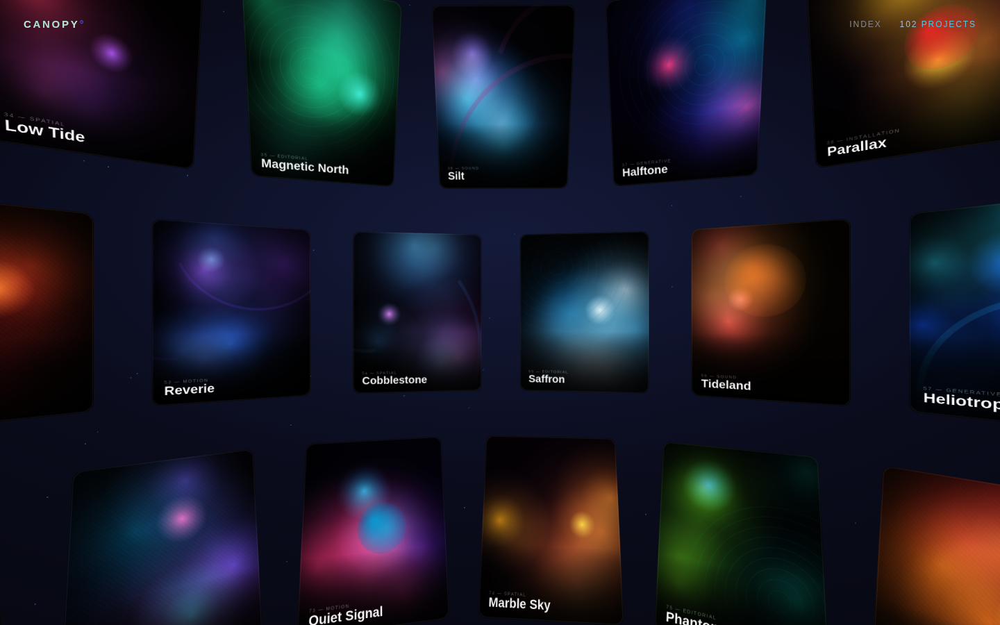

# Spherical Gallery — Three.js × GSAP

An inside-out spherical gallery inspired by [phantom.land](https://www.phantom.land/).
You stand at the centre of a sphere whose inner surface is tiled with project
cards, all facing you. **Left-click and drag** to orbit the view with smooth,
Lenis-style eased motion and release inertia. **Hover** a card to focus it, and
**tap** one to animate into a templated project page.



## Run it

No build step — it's plain ES modules served over HTTP.

```bash
cd spherical-gallery
npx http-server -p 8848 -c-1      # or: python3 -m http.server 8848
# open http://localhost:8848
```

Any static server works; it just can't be opened from `file://` because of ES
module / import-map CORS rules.

## What's going on

| Piece | File | Notes |
| --- | --- | --- |
| Scene & interaction | `src/gallery.js` | Camera sits at the sphere centre; cards are mapped onto the inner surface via per-ring `cos(latitude)` column counts so cells stay evenly spaced and never overlap at the poles. A custom rounded-rect SDF shader masks each card with anti-aliased corners and drives hover / focus states. |
| Drag + inertia | `src/gallery.js` | Pointer drag updates a *target* yaw/pitch; the actual rotation eases toward it every frame (frame-rate-independent lerp) and carries decaying momentum on release — the Lenis "smooth scroll" feel applied to orbit. |
| Artwork | `src/imageFactory.js` | Every card image is generated procedurally on a `<canvas>` (layered gradients + accent glows + geometric motif + film grain + baked caption). No external image assets or network needed. |
| Detail page | `src/detail.js` | GSAP timeline animates a templated project page in/out; [Lenis](https://github.com/darkroomengineering/lenis) provides smooth-scroll easing for the page body. |
| Entry / glue | `src/main.js` | Loader, hover caption that follows the cursor, intro reveal, wiring. |

## Tech

- **Three.js** — WebGL scene, geometry, raycasting, custom `ShaderMaterial`.
- **GSAP** — all UI/transition animation (intro stagger, hover, detail timeline).
- **Lenis** — smooth-scroll easing on the detail page (and the easing model the
  orbit drag borrows from).

Libraries are vendored under `vendor/` so the experience is fully self-contained
and runs offline.

## Verification

`test/drive.mjs` serves the project and drives it with headless Chromium
(Playwright): it checks WebGL initialises, the intro completes, drag orbits the
sphere, hover focuses a card, a tap opens the detail page, the page smooth-scrolls,
and closing returns to the gallery — capturing screenshots to `test/shots/` at
each step.

```bash
node test/drive.mjs
```
